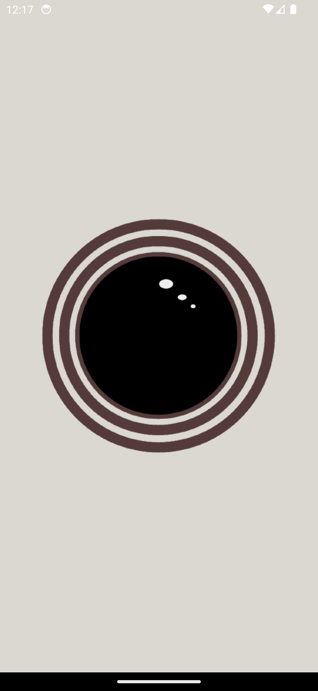
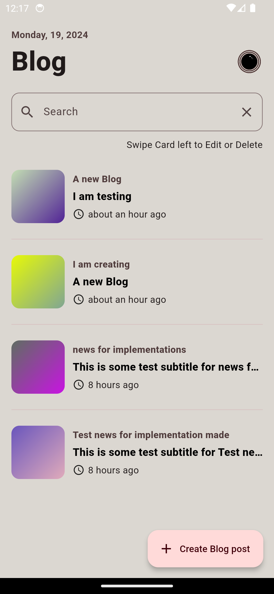
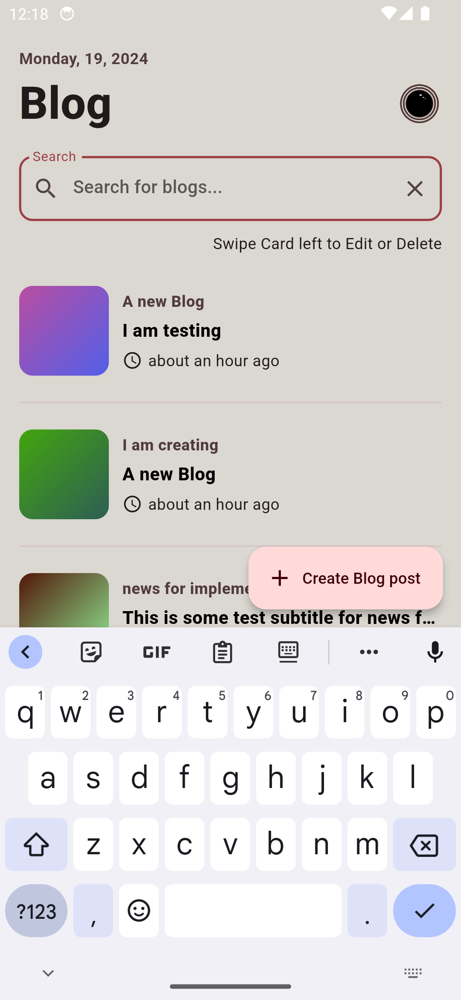
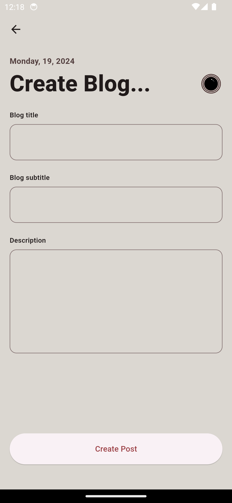
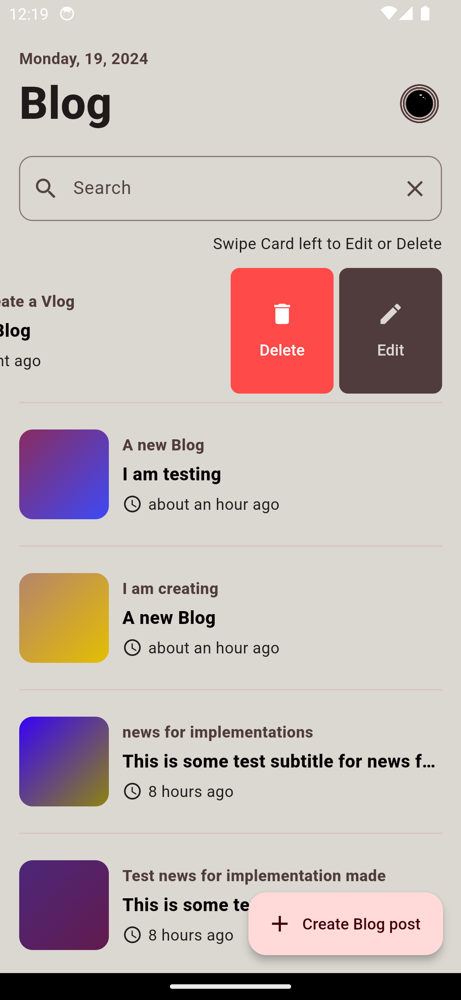
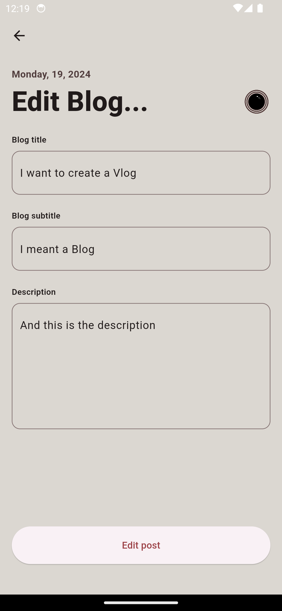
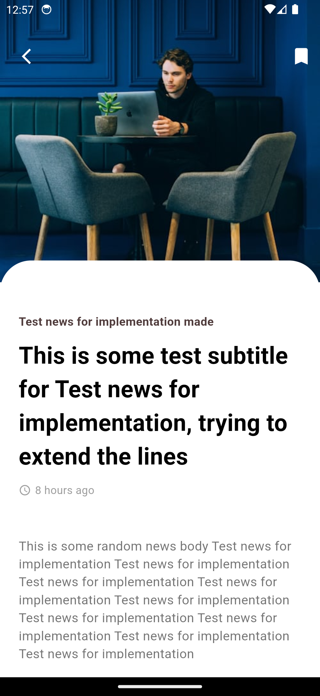

# vmodel_blog_app
## Getting Started

# ✨ Requirements
- Any Operating System (ie. MacOS X, Linux, Windows)
- Any IDE with Flutter SDK installed (ie. IntelliJ, Android Studio, VSCode etc)
- A little knowledge of Dart and Flutter
- Some fingers to code 😂
 

## App
Download the `app-release.apk` to try out the release version
 
<a href="./app-release.apk"></img></a>
 

## 🔌 Plugins
| Name | Usage |
|------|-------|
|[**RXDart**](https://pub.dev/packages/rxdart)| Implementing reactiveX api for asynchronous programming|
|[**Get_It**](https://pub.dev/packages/get_it)| Simple direct Service Locator |
|[**GraphQL_Flutter**](https://pub.dev/packages/graphql_flutter)| A GraphQL client for Flutter|
|[**Timeago**](https://pub.dev/packages/timeago)| Creating fuzzy timestamps| 

## 📸

| Images| Images|
|------|-------|
|||
|||
|||
||

